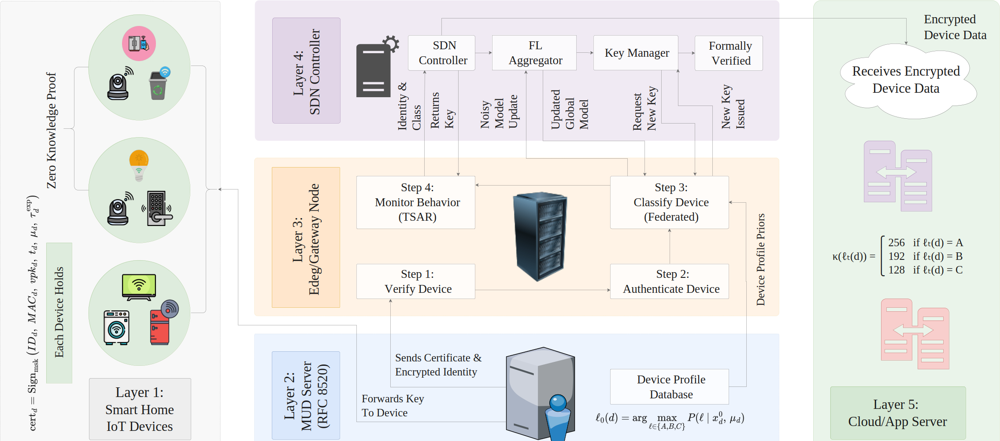
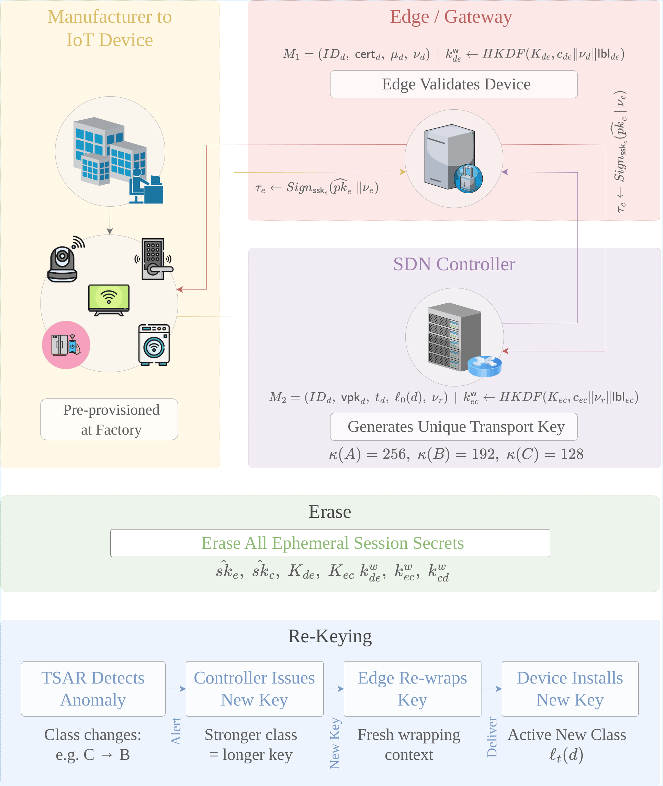
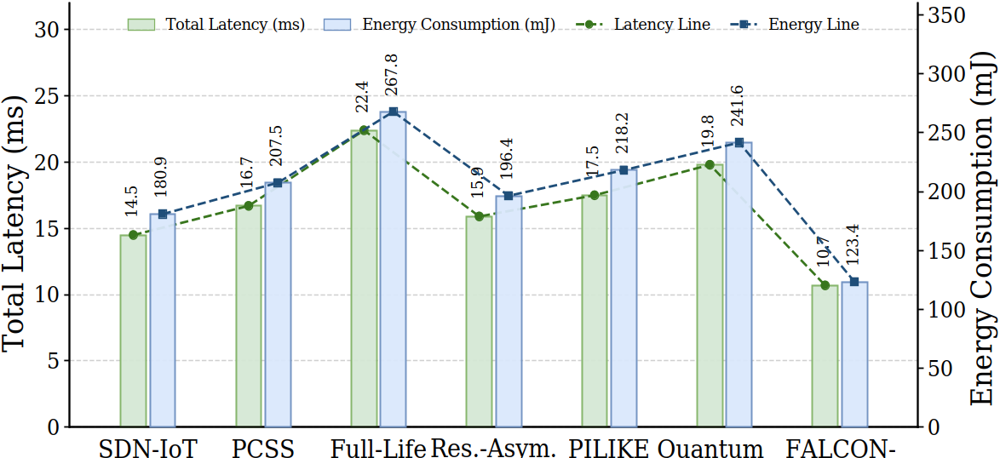
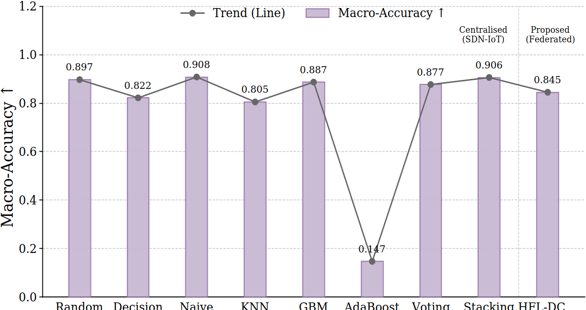
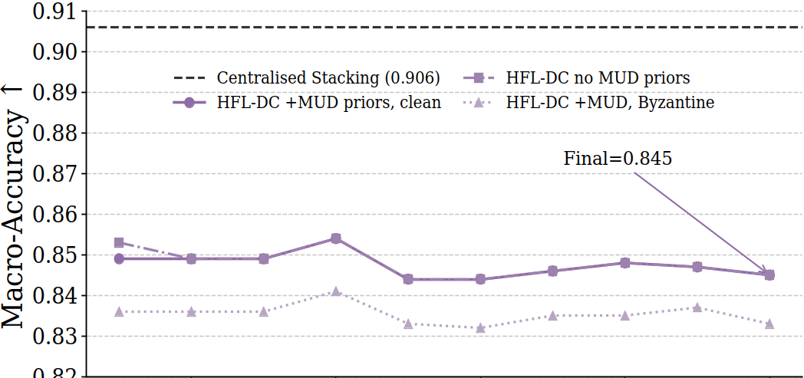
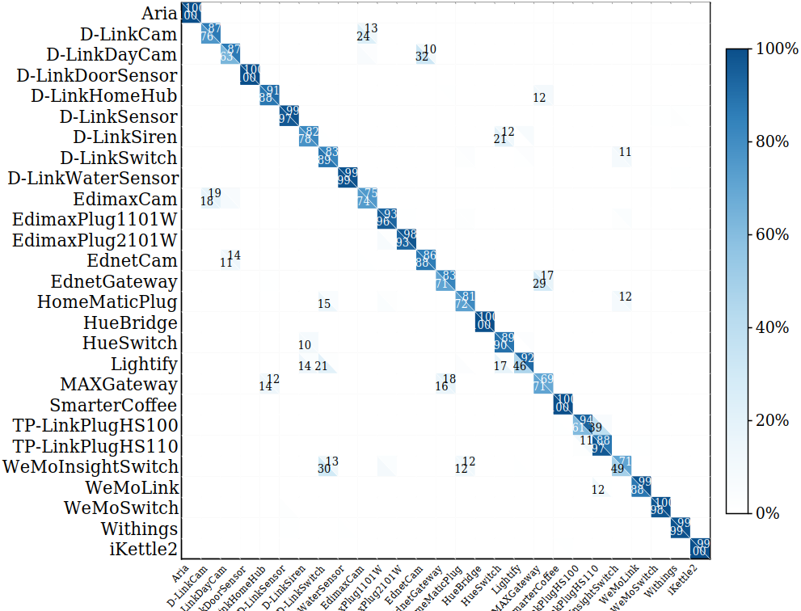
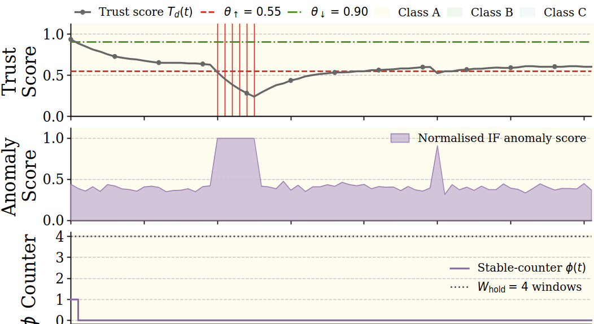
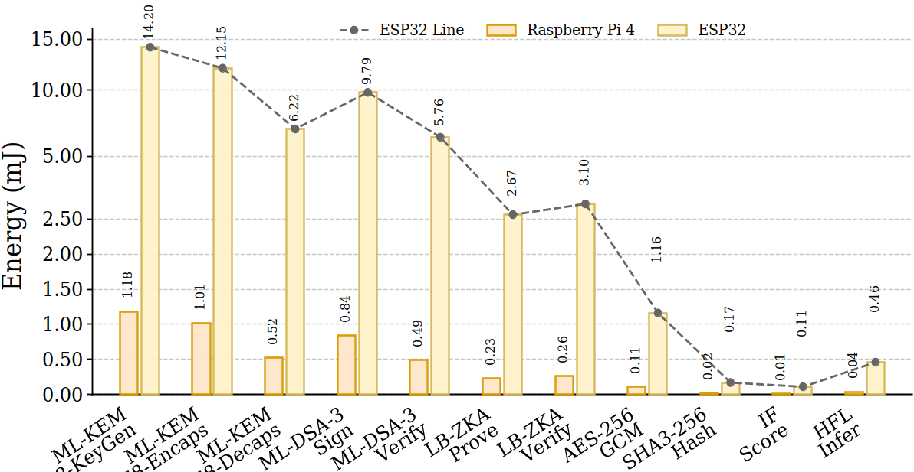

# Adaptive Post-Quantum Authentication for SDN-Managed Smart-Home IoT

**FALCON-SDIoT: Federated Adaptive Lattice-based Cryptographic Orchestration and Network Security for SDN-managed IoT**

[](https://www.python.org/)
[](https://jupyter.org/)
[](#iv-post-quantum-key-management-pq-km)
[](#v-hierarchical-federated-device-classification-hfl-dc)
[](#viii-symbolic-formal-verification)
[](LICENSE)

> **Paper:** Adaptive Post-Quantum Authentication for SDN-Managed Smart-Home IoT  
> **Authors:** Sameera, Uddin Md. Borhan, Arif Raza, Qianqian Liu, Kashif Sharif  
> **Venue:** IEEE Transactions on Dependable and Secure Computing (TDSC), 2026  
> **Project short name:** FALCON-SDIoT  
> **Naming note:** FALCON-SDIoT is the framework name. It is unrelated to the NIST FALCON signature scheme. The manuscript uses ML-KEM (FIPS 203) for key encapsulation and ML-DSA (FIPS 204) for digital signatures.

---

## Overview

<p align="justify">
This repository provides a research prototype for <b>adaptive post-quantum authentication in SDN-managed smart-home IoT networks</b>. The project addresses three co-occurring security challenges: quantum-capable adversaries threatening classical public-key authentication, centralized traffic analysis exposing sensitive household behavior, and static registration-time policies that cannot react when device behavior changes after onboarding.
</p>

<p align="justify">
FALCON-SDIoT integrates four modules into one adaptive security loop: <b>PQ-KM</b> for post-quantum certificate-backed key management, <b>HFL-DC</b> for privacy-preserving federated device classification, <b>LB-ZKA</b> for certified lattice-based proof-of-possession re-authentication, and <b>TSAR</b> for trust-score adaptive reclassification and class-dependent rekeying. Each behavioral decision has a concrete cryptographic effect. The SDN controller links these modules into a managed lifecycle under one consistent architecture.
</p>

> **Prototype note:** The notebook uses portable Python interfaces to simulate the ML-KEM and ML-DSA workflow. This keeps the code easy to run across machines while preserving protocol roles, key-delivery paths, accounting boundaries, and evaluation logic. For deployment, replace the simulation classes with certified or audited post-quantum libraries such as liboqs, PQClean, or vendor-supported ML-KEM/ML-DSA modules.

---

## Table of Contents

- [Why This Work Matters](#why-this-work-matters)
- [System Architecture](#system-architecture)
- [Module Descriptions](#module-descriptions)
  - [I. Post-Quantum Key Management (PQ-KM)](#i-post-quantum-key-management-pq-km)
  - [II. Hierarchical Federated Device Classification (HFL-DC)](#ii-hierarchical-federated-device-classification-hfl-dc)
  - [III. Lattice-Based Proof-of-Possession Authentication (LB-ZKA)](#iii-lattice-based-proof-of-possession-authentication-lb-zka)
  - [IV. Trust-Score Adaptive Reclassification and Rekeying (TSAR)](#iv-trust-score-adaptive-reclassification-and-rekeying-tsar)
- [Notebook Code Tour](#notebook-code-tour)
- [Key Results](#key-results)
- [Repository Layout](#repository-layout)
- [Requirements](#requirements)
- [Quick Start](#quick-start)
- [Formal Verification](#formal-verification)
- [Security and Deployment Notes](#security-and-deployment-notes)
- [Reproducibility Notes](#reproducibility-notes)
- [Troubleshooting](#troubleshooting)

---

## Why This Work Matters

<p align="justify">
Smart-home IoT security needs more than one-time device registration. A practical system must support quantum-aware authentication, protect household traffic privacy, react to device behavior changes, and convert suspicious behavior into concrete cryptographic responses. Alerts and SDN flow updates are useful, but high-risk behavior should also trigger stronger keys, fresh rekeying, or delayed relaxation to prevent fast attacker recovery.
</p>

<p align="justify">
FALCON-SDIoT addresses this gap by coupling post-quantum key management, federated device classification, certified lattice proof-of-possession, and trust-driven adaptive rekeying inside one SDN-managed architecture. The design novelty lies in this integrated security lifecycle rather than in any single new cryptographic primitive.
</p>

---

## System Architecture

<p align="center">
  
</p>

<p align="justify">
FALCON-SDIoT operates across five cooperating layers. Smart-home IoT devices hold identity material, manufacturer certificates, ML-DSA signing keys, lattice proof keys, and active transport keys. The MUD profile server provides device-type behavior priors defined by RFC 8520 for cold-start classification. The edge gateway verifies certificates, runs local classification, checks recurring proofs, computes trust scores, and forwards management messages. The SDN controller and federated-learning aggregator maintain device classes, issue transport keys, install flow rules, aggregate protected model updates, and coordinate rekeying. Local or cloud services receive encrypted device traffic protected by the active class-dependent transport key.
</p>

| Layer | Role |
|---|---|
| Layer 1 — Smart-home IoT devices | Hold device identity, MAC address, device type, ML-DSA signing key pair, lattice proof key pair, and active transport key. |
| Layer 2 — MUD server (RFC 8520) | Provides device-type behavior priors used by HFL-DC for cold-start classification. |
| Layer 3 — Edge / gateway node | Verifies certificates, runs local classification, verifies LB-ZKA transcripts, computes TSAR trust scores, and forwards control messages to the controller. |
| Layer 4 — SDN controller / FL aggregator | Maintains device security classes, issues class-dependent transport keys, installs SDN flow policies, aggregates protected federated updates, and coordinates rekeying. |
| Layer 5 — Cloud / app server | Receives encrypted device traffic protected by the active transport key whose length is determined by the current class. |

<p align="justify">
The controller maps each device class to a symmetric key strength. High-risk or hardened devices (Class A) receive 256-bit keys. Medium-risk devices (Class B) receive 192-bit keys. Lower-risk stable devices (Class C) use 128-bit keys while remaining under continuous TSAR monitoring.
</p>

| Class | Typical meaning | Transport key length (bits) | AES variant |
|---|---|---:|---|
| A | High-risk or hardened devices | 256 | AES-256 |
| B | Medium-risk devices | 192 | AES-192 |
| C | Lower-risk stable devices | 128 | AES-128 |

---

## Module Descriptions

### I. Post-Quantum Key Management (PQ-KM)

<p align="center">
  
</p>

<p align="justify">
PQ-KM provides the cryptographic lifecycle in FALCON-SDIoT (paper Section IV). It verifies certified device identity, establishes ephemeral post-quantum secrets, issues class-based transport keys, renews keys after class changes, and erases temporary secrets after session completion.
</p>

The manufacturer issues a certificate binding device identity, MAC address, ML-DSA verification key, lattice public key, device type, and expiration time:

```
cert_d = Sign_msk(ID_d, MAC_d, vpk_d, t_d, µ_d, τ_exp_d)
```

ML-KEM is used for post-quantum shared-secret encapsulation. ML-DSA is used for certificate verification and authentication of ephemeral public keys. After encapsulation, the raw KEM shared secret is not used directly as a transport key. Instead, the wrapping key is derived using HKDF with role-separated context labels:

```
k_wrap = HKDF(K, c ∥ ν ∥ lbl)
```

The label `lbl` separates device-to-edge, edge-to-controller, and controller-to-device key derivations. After key delivery, all ephemeral ML-KEM private keys, shared secrets, and wrapping keys are erased. TSAR-triggered class changes call the same managed rekeying path.

**Objects used in the notebook:**

```text
ManufacturerCA           — issues and verifies ML-DSA manufacturer certificates
KyberKEM                 — simulates ML-KEM encapsulation and decapsulation
DilithiumSign            — simulates ML-DSA signing and verification
PQ_KM                    — orchestrates onboarding, key distribution, and rekeying
CU.sha3()                — SHA3-256 transcript hashing
CU.hkdf()                — role-separated HKDF key derivation
CU.enc() / CU.dec()      — AES-GCM encryption and decryption for protected messages
```

---

### II. Hierarchical Federated Device Classification (HFL-DC)

<p align="justify">
HFL-DC classifies IoT devices into operational security classes without centralizing raw household traffic (paper Section V). It supports PQ-KM by producing the initial class assignment during onboarding and supports TSAR by providing class evidence that can later be adjusted when device trust changes.
</p>

The prototype uses 27 smart-home IoT device types drawn from the IoT Sentinel benchmark, 10 synthetic traffic features, non-IID Dirichlet edge partitions (α = 0.5), gradient clipping, Gaussian differential privacy, Multi-Krum Byzantine-resilient aggregation, and federated averaging over selected updates.

**MUD-guided cold-start:** For devices with limited bootstrap traffic, HFL-DC uses RFC 8520 MUD profiles as class priors. The initial class is assigned by a maximum-a-posteriori rule combining the MUD prior with bootstrap traffic features.

**Differential privacy:** Before transmitting a local model update, each edge clips the update and adds calibrated Gaussian noise:

```
∆̃_i = ∆_i / max(1, ‖∆_i‖₂ / C_c) + N(0, σ²_DP I)
```

With C_c = 1, ε_r = 1.2, δ_r = 10⁻⁵, and R = 10 rounds, the approximate total privacy budget is (ε_total, δ) = (4.35, 10⁻⁵) under Rényi composition.

**Multi-Krum aggregation:** The server computes a pairwise distance score for each protected update and retains the m_K = N_E − f − 2 updates with the smallest scores, where N_E is the number of edges and f is the Byzantine budget. The evaluation uses N_E = 6, f = 1, m_K = 3.

**Federated training summary:**

```
local traffic at edge
        │
        ▼
local model update (XGBoost / scikit-learn)
        │
        ▼
clip gradient update and add Gaussian DP noise
        │
        ▼
Multi-Krum Byzantine-resilient outlier filtering
        │
        ▼
weighted federated averaging over selected updates
        │
        ▼
updated global device-class model → returned to edges
```

**Objects used in the notebook:**

```text
HFL_DC.train_local()     — local model training at each edge with DP noise
HFL_DC.multi_krum()      — Byzantine-resilient update selection
HFL_DC.aggregate()       — weighted federated averaging
HFL_DC.predict()         — device classification at inference time
mud_prior()              — MUD-guided cold-start prior lookup
dp_accountant()          — Rényi differential-privacy budget accounting
```

---

### III. Lattice-Based Proof-of-Possession Authentication (LB-ZKA)

<p align="justify">
LB-ZKA provides repeated re-authentication after PQ-KM onboarding (paper Section VI). It allows a device to prove possession of its certified lattice secret s_d without exposing that secret. The lattice public key t_d is bound to the manufacturer certificate, so the proof is tied to the certified device identity under the manufacturer trust anchor. This prevents public-key substitution during repeated re-authentication.
</p>

The certified public key is defined over the polynomial quotient ring R_q = Z_q[X]/(X^n + 1) with n = 256 and q = 8,380,417:

```
t_d = A · s_d mod q,   ‖s_d‖_∞ ≤ η_s
```

Each proof session begins with the edge issuing a fresh single-use verifier nonce ν_a. The device forms a proof statement binding its identity, the nonce, and a timestamp. The proof transcript is generated non-interactively using the Fiat-Shamir transform in the random-oracle model and verified at the edge with a freshness check and nonce-set lookup. After acceptance, ν_a is removed from the outstanding nonce set to enforce single-use replay resistance.

**Soundness (Theorem 1):** Any quantum polynomial-time adversary causing the edge to accept a fresh transcript for device d without knowledge of s_d succeeds with negligible probability in the security parameter λ. Certificate binding prevents public-key substitution. Replay resistance follows from the single-use nonce and timestamp bound.

**Objects used in the notebook:**

```text
LB_ZKA.keygen()          — lattice proof key generation (public key t_d, secret key s_d)
LB_ZKA.prove()           — non-interactive Fiat-Shamir proof transcript generation
LB_ZKA.verify()          — proof transcript verification with nonce and timestamp checks
LB_ZKA.authenticate()    — full re-authentication session orchestration
```

---

### IV. Trust-Score Adaptive Reclassification and Rekeying (TSAR)

<p align="justify">
TSAR links device behavior changes to cryptographic policy (paper Section VII). It continuously observes device traffic over sliding windows, updates a trust score using Isolation Forest anomaly evidence, and decides whether to keep, harden, or relax the current security class. Every class transition invokes PQ-KM to issue a fresh key of the new class length.
</p>

The trust score is updated at each window t using an exponential moving average with smoothing factor α_T = 0.85 (effective memory ≈ 6.67 windows):

```
T_d(t) = 0.85 · T_d(t−1) + 0.15 · (1 − s̄_d(t))
```

where s̄_d(t) ∈ [0, 1] is the normalized Isolation Forest anomaly score. The initial trust score T_d(0) = 1 is assigned at onboarding.

**TSAR policy — asymmetric hardening and delayed relaxation:**

| Condition | Action |
|---|---|
| T_d(t) < θ_h = 0.55 | Immediate hardening; φ counter reset; PQ-KM rekeying if class changes |
| T_d(t) > θ_r = 0.90 and hold satisfied (φ·W_s ≥ W_h) | Relaxation; φ counter reset; PQ-KM rekeying if class changes |
| T_d(t) > θ_r = 0.90 and hold not satisfied | Increment φ counter; class unchanged |
| Otherwise | Class and φ unchanged |

The hold duration W_h = 60 minutes with sliding window W_s = 15 minutes prevents short spoofed benign bursts from forcing premature relaxation.

**TSAR feature vector (computed at the edge):**

```text
mean_iat_ms        — mean inter-arrival time
byte_count_pm      — estimated byte rate per minute
tcp_ratio          — TCP / total traffic ratio
dst_port_entropy   — destination-port entropy
conn_count_pm      — connection-attempt rate per minute
tls_ratio          — TLS-protected traffic ratio
```

**Objects used in the notebook:**

```text
TSAR.update_trust()      — trust score update using Isolation Forest anomaly evidence
TSAR.reclassify()        — policy application with hardening and delayed relaxation
TSAR.trigger_rekey()     — calls PQ-KM when security class changes
IsolationForest          — scikit-learn anomaly scoring model (calibrated)
```

---

## Notebook Code Tour

The notebook `post_quantum_iot.ipynb` follows the paper section order. Each block below maps notebook cells to the corresponding paper section and module.

```
post_quantum_iot.ipynb
│
├── [SETUP] Imports, Configuration, and Seeds
│     ├── Library imports: numpy, pandas, scipy, sklearn, matplotlib, seaborn, cryptography, xgboost
│     ├── Global random seed fixation for reproducibility
│     └── Matplotlib / Seaborn plotting style configuration
│
├── [PAPER §III] System Model — Device Taxonomy and Traffic Profiles
│     ├── 27-device smart-home IoT taxonomy (cameras, plugs, locks, sensors, hubs, appliances)
│     ├── Per-device synthetic traffic profiles: mean IAT, byte rate, TCP ratio, port entropy, TLS ratio
│     ├── MUD-profile prior table: (ρ_{µ,A}, ρ_{µ,B}, ρ_{µ,C}) per device type
│     └── Security class mapping: A (high-risk), B (medium-risk), C (low-risk)
│
├── [PAPER §III] Protocol Accounting Constants
│     ├── Timing constants: primitive latencies for ML-KEM, ML-DSA, LB-ZKA, AES-GCM, SHA3
│     ├── Energy constants: per-operation mJ values for Platform 1 (Raspberry Pi 4) and Platform 2 (ESP32)
│     └── Communication overhead: message size accounting per protocol phase
│
├── [PAPER §V] Differential-Privacy Accounting Helper
│     ├── Gaussian noise scale σ_DP from clipping bound C_c, ε_r, δ_r
│     └── Rényi composition budget (ε_total, δ) across R rounds
│
├── [PAPER §IV] Cryptographic Helper Utilities (CU)
│     ├── CU.sha3()     — SHA3-256 transcript hashing
│     ├── CU.hkdf()     — HKDF key derivation with role-label context separation
│     ├── CU.enc()      — AES-GCM authenticated encryption
│     └── CU.dec()      — AES-GCM authenticated decryption
│
├── [PAPER §IV] Manufacturer Certificate Authority (ManufacturerCA)
│     ├── msk / mpk key pair generation
│     ├── cert_d = Sign_msk(ID_d, MAC_d, vpk_d, t_d, µ_d, τ_exp_d) — Eq. (1)
│     └── Certificate verification: Verify_mpk(cert_d)
│
├── [PAPER §IV] ML-KEM Interface Simulation (KyberKEM)
│     ├── KeyGen()      — ephemeral KEM key pair (pk, sk) generation
│     ├── Encaps(pk)    — ciphertext and shared secret (c, K)
│     └── Decaps(sk, c) — shared secret recovery K
│
├── [PAPER §IV] ML-DSA Interface Simulation (DilithiumSign)
│     ├── KeyGen()      — ML-DSA signing and verification key pair (ssk, vpk)
│     ├── Sign(ssk, m)  — signature σ over message m
│     └── Verify(vpk, m, σ) — signature verification
│
├── [PAPER §IV / ALGORITHM 1] PQ-KM Onboarding and Key Distribution (PQ_KM)
│     ├── Edge and controller ephemeral key announcement with ML-DSA binding — Eqs. (8–9)
│     ├── Device registration payload: cert_d, ID_d, µ_d, nonce ν_d, signature σ_d
│     ├── ML-KEM device-to-edge encapsulation: (c_de, K_de); HKDF wrapping key derivation
│     ├── Edge certificate and signature verification; initial class assignment via HFL-DC
│     ├── Edge-to-controller ML-KEM registration: (c_ec, K_ec) with class and proof-key forwarding
│     ├── Controller key issuance: k^(0)_d ←$ {0,1}^{κ(ℓ_0(d))} — Eq. (7)
│     ├── Controller-to-device protected key delivery via re-wrapped channel
│     ├── Device key installation and nonce verification
│     └── Ephemeral secret erasure: sk_ce, sk_cc, K_de, K_ec, k^w_de, k^w_ec, k^w_cd — Algorithm 1, line 27
│
├── [PAPER §IV / FIGURE 2] TSAR-Triggered Rekeying Flow
│     ├── Class transition detection: ℓ_t(d) ≠ ℓ_{t−1}(d)
│     ├── Controller issues fresh k^(t)_d with new key length κ(ℓ_t(d)) — Eq. (5)
│     ├── Edge re-wraps key using fresh HKDF context
│     └── Device installs new key and erases old ephemeral state
│
├── [PAPER §VI] LB-ZKA Proof Key Generation
│     ├── Ring parameters: n = 256, q = 8,380,417, R_q = Z_q[X]/(X^n + 1) — Eq. (17)
│     ├── Public matrix A ∈ R_q^{k×ℓ_s}, secret s_d with ‖s_d‖_∞ ≤ η_s
│     └── Certified public key: t_d = A · s_d mod q — Eq. (18)
│
├── [PAPER §VI] LB-ZKA Proof Generation and Verification
│     ├── LB_ZKA.keygen()       — lattice proof key pair (t_d, s_d) generation
│     ├── LB_ZKA.prove()        — non-interactive Fiat-Shamir transcript π_d — Eq. (20)
│     ├── LB_ZKA.verify()       — transcript check with nonce set N_v and timestamp bound Δτ — Eq. (21)
│     └── LB_ZKA.authenticate() — full session: nonce issuance → proof → verification → nonce expiry
│
├── [PAPER §V / ALGORITHM implied] HFL-DC Federated Training
│     ├── Dirichlet non-IID partition across N_E = 6 edges (α_Dir = 0.5)
│     ├── Local model training per edge (XGBoost / scikit-learn classifier)
│     ├── Gradient clipping to bound C_c = 1 and Gaussian DP noise addition — Eq. (13)
│     ├── Multi-Krum score χ_i for each protected update — Eq. (15)
│     ├── Retention of m_K = N_E − f − 2 = 3 updates with smallest scores
│     ├── Weighted global aggregation over retained set S_K — Eq. (16)
│     └── R = 10 federated rounds with and without MUD priors; with and without Byzantine edge
│
├── [PAPER §VII / ALGORITHM 2] TSAR Reclassification and Rekeying
│     ├── Isolation Forest anomaly model training per device type
│     ├── Trust score initialization: T_d(0) = 1, φ_0(d) = 0
│     ├── Per-window trust update: T_d(t) = α_T · T_d(t−1) + (1−α_T) · (1−s̄_d(t)) — Eq. (22)
│     ├── Hardening check: T_d(t) < θ_h = 0.55 → Hdn(ℓ) + PQ-KM rekey
│     ├── Relaxation check: T_d(t) > θ_r = 0.90 and φ·W_s ≥ W_h = 60 min → Rlx(ℓ) + PQ-KM rekey
│     └── Scenario traces: camera hijack, plug anomaly, firmware drift, adversarial benign spoof
│
├── [PAPER §X-A] Synthetic Dataset Generation
│     ├── 24,300 samples across 27 device types (Class A: 9,000 / B: 8,100 / C: 7,200)
│     ├── 10 traffic features per sample from per-device profile distributions
│     ├── Attack-window behavior injected per threat scenario (Section III)
│     └── 80/20 train-test split
│
├── [PAPER §X-D] Centralized Baseline Model Training
│     ├── Random Forest, Decision Tree, Naive Bayes, KNN, GBM, AdaBoost, Voting, Stacking
│     └── Macro-accuracy, F1, precision, recall on the 80/20 test split
│
├── [PAPER §X-B / TABLE VII–VIII] Protocol Cost Computation
│     ├── Primitive-level latency and energy: ML-KEM KeyGen/Encaps/Decaps, ML-DSA Sign/Verify,
│     │   LB-ZKA Prove/Verify, AES-256-GCM, SHA3-256, IF score, HFL-DC inference
│     ├── Full onboarding path: ephemeral key announcement + device auth + edge-controller
│     │   registration + controller delivery (Table VIII)
│     └── Recurring authentication: E_tot = E_cry + E_rad + E_edg + E_ctrl + E_idle — Eq. (27)
│
├── [PAPER §X-C / TABLE IX / FIGURE 4] Recurring Authentication Comparison
│     └── FALCON-SDIoT vs. SDN-IoT, PCSS, Full-Life Auth, Res.-Asym. Auth, PILIKE, Quantum2FA
│         on total latency, energy, state size, communication overhead, and PQ support
│
├── [PAPER §X-D / FIGURES 5–7 / TABLES X] HFL-DC Classification Evaluation
│     ├── Centralized baselines vs. HFL-DC macro-accuracy under (ε, δ)-DP — Figure 5
│     ├── Convergence across 10 rounds: clean, MUD, Byzantine — Figure 6
│     └── Confusion matrix across 27 device types at Round 10 — Figure 7
│
├── [PAPER §X-E / TABLE XI / FIGURE 8] TSAR Detection Evaluation
│     ├── Four scenario traces (72 hours each, W_s = 15 min, 288 windows per trace)
│     ├── Trust score, anomaly score, and benign-counter traces — Figure 8
│     └── TPR, FPR, detection latency, and triggered action per scenario — Table XI
│
└── [OUTPUT] Figure and Table Saving
      ├── figures/pq-km.png, figures/sd-iot.png
      └── graphs/accuracy.png, confusion.png, energy.png, hfl.png, performance.png, tsar.png
```

---

## Key Results

<p align="justify">
The following values summarize the paper-reported evaluation on the curated synthetic IoT traffic benchmark. Small differences can occur when library versions, seeds, or execution environments change. The TSAR false-positive result is specific to the four evaluated scenario-bounded traces and is not a universal deployment guarantee.
</p>

| Result area | Reported value |
|---|---|
| Synthetic benchmark size | 24,300 samples, 27 device types, 10 traffic features |
| HFL-DC macro-accuracy (clean, Round 10) | 0.845 under (ε, δ) = (4.35, 10⁻⁵) differential privacy |
| Privacy-utility gap vs. best centralized baseline | 6.1–6.3 percentage points (Stacking: 0.906, HFL-DC: 0.845) |
| Byzantine degradation (1 Byzantine edge, Round 10) | 0.845 → 0.833 (1.3 percentage-point drop) |
| Recurring authentication latency (Platform 1) | 10.69 ms total (4.88 ms IoT + 5.81 ms edge) |
| Recurring authentication energy (Platform 1) | 123.41 mJ per session |
| Latency reduction vs. SDN-IoT baseline | 26.2% |
| Energy reduction vs. SDN-IoT baseline | 31.8% |
| Full onboarding cost (Platform 1) | 82.79 ms (device: 19.77 + edge: 40.30 + controller: 22.72) |
| TSAR false-positive rate (4 evaluated traces) | 0.0% |
| TSAR detection latency (attack scenarios) | ≤ 3 sliding windows (≤ 45 minutes) |
| ProVerif 2.05 symbolic queries | All 6 return SAFE |

### Recurring Authentication Comparison (Platform 1)

| Scheme | Venue | Total (ms) | Energy (mJ) | PQ |
|---|---|---:|---:|---|
| SDN-IoT | CN 2024 | 14.48 | 180.88 | No |
| PCSS | JSEN 2022 | 16.73 | 207.50 | No |
| Full-Life Auth | TDSC 2023 | 22.35 | 267.80 | No |
| Res.-Asym. Auth | TDSC 2023 | 15.91 | 196.40 | No |
| PILIKE | JSYST 2024 | 17.46 | 218.22 | Yes |
| Quantum2FA | TDSC 2023 | 19.82 | 241.60 | Yes |
| **FALCON-SDIoT** | **This work** | **10.69** | **123.41** | **Yes** |

---

## Repository Layout

```text
post-quantum-iot-main/
├── figures/
│   ├── pq-km.png          ← post-quantum onboarding, key delivery, erasure, and rekeying flow (Fig. 2)
│   └── sd-iot.png         ← FALCON-SDIoT five-layer architecture diagram (Fig. 1)
│
├── graphs/
│   ├── accuracy.png       ← centralized baselines vs. HFL-DC macro-accuracy (Fig. 5)
│   ├── confusion.png      ← HFL-DC confusion matrix at Round 10, 27 device types (Fig. 7)
│   ├── energy.png         ← primitive-level energy comparison Platform 1 vs. Platform 2 (Fig. 3)
│   ├── hfl.png            ← HFL-DC convergence across 10 rounds: clean, MUD, Byzantine (Fig. 6)
│   ├── performance.png    ← recurring authentication latency and energy comparison (Fig. 4)
│   └── tsar.png           ← trust score, anomaly score, and benign-counter trace (Fig. 8)
│
├── post_quantum_iot.ipynb ← executable paper-aligned prototype (paper Sections IV–X)
├── README.md              ← this file
└── LICENSE                ← MIT license
```

---

## Requirements

**Recommended environment:**

- Ubuntu 20.04 / 22.04 or a recent Linux distribution
- Python 3.10
- Jupyter Notebook or JupyterLab

**Python packages:**

```bash
conda create -n falcon-sdiot python=3.10 -y
conda activate falcon-sdiot

pip install \
  numpy pandas scipy scikit-learn matplotlib seaborn \
  cryptography xgboost jupyter
```

**Optional — ProVerif 2.05** (for formal verification, paper Section VIII):

```bash
sudo apt-get update
sudo apt-get install -y ocaml wget tar make gcc

wget https://bblanche.gitlabpages.inria.fr/proverif/proverif2.05.tar.gz
tar -xzf proverif2.05.tar.gz
cd proverif2.05
./build
./proverif -version
```

**Optional — liboqs** (for production-grade ML-KEM and ML-DSA operations):

```bash
pip install pyoqs
```

> Replace the notebook's simulation classes `KyberKEM` and `DilithiumSign` with liboqs bindings for deployment-grade evaluation.

---

## Quick Start

### 1. Clone the repository

```bash
git clone https://github.com/umborhan/post-quantum-iot.git
cd post-quantum-iot-main
```

### 2. Create the environment

```bash
conda create -n falcon-sdiot python=3.10 -y
conda activate falcon-sdiot
pip install -q numpy pandas scipy scikit-learn matplotlib seaborn cryptography xgboost jupyter
```

### 3. Create output directories

```bash
mkdir -p figures graphs
```

### 4. Run the notebook

```bash
jupyter notebook post_quantum_iot.ipynb
```

Open the notebook and run all cells from top to bottom. The full pipeline runs in paper section order: system model → cryptographic utilities → PQ-KM → LB-ZKA → HFL-DC → TSAR → dataset generation → baselines → evaluation → figure export.

### 5. Optional: export to Python script

```bash
jupyter nbconvert --to script post_quantum_iot.ipynb
python post_quantum_iot.py
```

---

## Expected Pipeline Output

A complete run generates the following in order:

1. Synthetic smart-home IoT traffic benchmark (24,300 samples, 27 device types)
2. Centralized baseline models (Random Forest, Decision Tree, Naive Bayes, KNN, GBM, AdaBoost, Voting, Stacking)
3. HFL-DC training across 10 federated rounds (clean, MUD prior, Byzantine) with DP accounting
4. PQ-KM onboarding and key distribution simulation (Algorithm 1)
5. LB-ZKA re-authentication session simulation (proof generation and verification)
6. TSAR behavior simulation across four scenario traces
7. Figures saved to `figures/` and `graphs/`
8. Performance and classification tables printed to notebook output

Expected dataset configuration:

```text
Samples:        24,300
Device types:   27
Features:       10 traffic features (mean IAT, byte rate, TCP ratio, port entropy, conn rate, TLS ratio, ...)
Classes:        A (9,000 samples), B (8,100 samples), C (7,200 samples)
Train / Test:   80 / 20 split
Federated:      N_E = 6 edges, α_Dir = 0.5 Dirichlet split, f = 1 Byzantine budget
```

---

## Formal Verification

<p align="justify">
The paper reports ProVerif 2.05 symbolic verification for the PQ-KM onboarding, rekeying, and LB-ZKA proof-binding logic (paper Section VIII). The model encodes ML-KEM as an ideal public-key establishment abstraction, ML-DSA and the manufacturer certificate through signature and verification functions, HKDF as a one-way derivation with role-separated inputs, and all nonces as fresh values. The controller-to-edge channel is declared private per the trust model in Section III.
</p>

| Query | Property | Maps to Threat | Maps to Goal | Result |
|---|---|---|---|---|
| Q1 | Transport-key secrecy | Key disclosure | G1, G5 | SAFE |
| Q2a | Controller-edge injective agreement | Controller-edge mismatch | G2, G6 | SAFE |
| Q2b | Device-controller injective agreement | Device-controller mismatch | G2 | SAFE |
| Q3 | Forward secrecy after signing-key reveal | Long-term key compromise | G5 | SAFE |
| Q4a | LB-ZKA replay resistance | Proof replay | G3 | SAFE |
| Q4b | LB-ZKA no impersonation | Proof impersonation | G3 | SAFE |

> ProVerif results are symbolic protocol-model evidence under the Dolev-Yao model. They do not prove concrete implementation security, side-channel resistance, or computational hardness of the underlying lattice problems.

---

## Security and Deployment Notes

<p align="justify">
This repository is a research prototype. Before using similar logic in a real deployment:
</p>

- Replace `KyberKEM` and `DilithiumSign` simulation classes with certified ML-KEM and ML-DSA implementations such as liboqs, PQClean, or vendor-supported FIPS 203/204 modules.
- Use hardware-backed key storage (HSM or secure enclave) on edge gateways and the SDN controller.
- Add secure boot and firmware integrity verification on all IoT devices.
- Strengthen the SDN controller through replicated controllers, threshold signing, distributed policy state, and failure recovery.
- Compress or fragment LB-ZKA proof payloads (720 bytes) for low-rate links such as IEEE 802.15.4 and 6LoWPAN.
- Revisit differential-privacy budgets for schedules longer than R = 10 rounds; consider personalized budgets and adaptive clipping.
- Validate TSAR thresholds (θ_h, θ_r, W_h) on real household traffic traces from diverse device vendors and firmware versions before deployment.
- Add real device attestation before allowing sensitive class transitions from A to B or B to C.

---

## Reproducibility Notes

- Use Python 3.10 and the same package versions when comparing numbers with the manuscript.
- Keep deterministic seeds fixed where the notebook defines them.
- XGBoost may introduce small numeric differences across platforms and versions.
- Differential privacy adds controlled Gaussian noise, so exact round-level accuracy values may vary by a small margin.
- The current benchmark is synthetic and curated for controlled evaluation; real deployment requires validation on longer, real household traffic traces.
- To record your environment:

```bash
python --version
pip freeze > requirements_lock.txt
```

---

## Graphs and Visual Outputs

### Performance Comparison (Figure 4)

<p align="center">
  
</p>

FALCON-SDIoT achieves the lowest recurring authentication latency (10.69 ms) and energy (123.41 mJ) among all compared schemes, while being the only post-quantum design in the comparison.

---

### Classification Accuracy (Figure 5)

<p align="center">
  
</p>

HFL-DC achieves 0.845 macro-accuracy under (ε, δ)-differential privacy. The best centralized baseline (Naive Bayes) reaches 0.908. The 6.3 percentage-point gap reflects the expected privacy-utility trade-off from keeping raw traffic local.

---

### HFL-DC Convergence (Figure 6)

<p align="center">
  
</p>

The federated classifier converges to 0.845 by Round 10. One Byzantine edge reduces this to 0.833 (1.3 percentage-point degradation), validating the Multi-Krum aggregation design.

---

### Confusion Matrix (Figure 7)

<p align="center">
  
</p>

Most device types achieve strong recall. The most challenging cases involve device types with overlapping traffic profiles, similar byte rates, and similar protocol mixes.

---

### TSAR Trust Response (Figure 8)

<p align="center">
  
</p>

The representative D-LinkCam trace shows trust reduction during the attack window, rising anomaly scores in the same period, and the benign-window counter confirming that relaxation is correctly blocked during the 25-minute adversarial benign spoof.

---

### Primitive Energy Costs (Figure 3)

<p align="center">
  
</p>

LB-ZKA re-authentication (0.23 mJ prove + 0.26 mJ verify on Platform 1) is substantially lighter than a full ML-KEM onboarding sequence, validating the design choice of using PQ-KM once at registration and LB-ZKA for all subsequent sessions.

---

## Troubleshooting

### `ModuleNotFoundError: No module named 'xgboost'`

```bash
pip install xgboost
```

If the notebook contains an import fallback, most non-XGBoost logic can still run, but the full baseline comparison requires XGBoost.

---

### `cryptography` installation fails

```bash
python -m pip install --upgrade pip setuptools wheel
pip install cryptography
```

---

### Figures are not displayed on GitHub

Check that file names match the README paths exactly. Linux paths are case-sensitive.

```text
figures/pq-km.png      figures/sd-iot.png
graphs/accuracy.png    graphs/confusion.png
graphs/energy.png      graphs/hfl.png
graphs/performance.png graphs/tsar.png
```

---

### Figures are not generated by the notebook

Create the output directories and rerun the figure cells:

```bash
mkdir -p figures graphs
```

---

### ProVerif is not found

```bash
export PATH=$PATH:/path/to/proverif2.05
proverif -version
```


## License

<p align="justify">
This project is released for academic and research use. See <code>LICENSE</code> for details.
</p>

---


